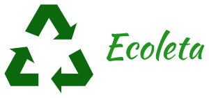
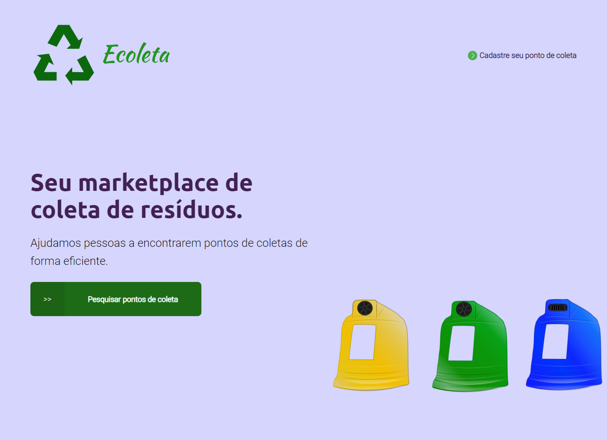
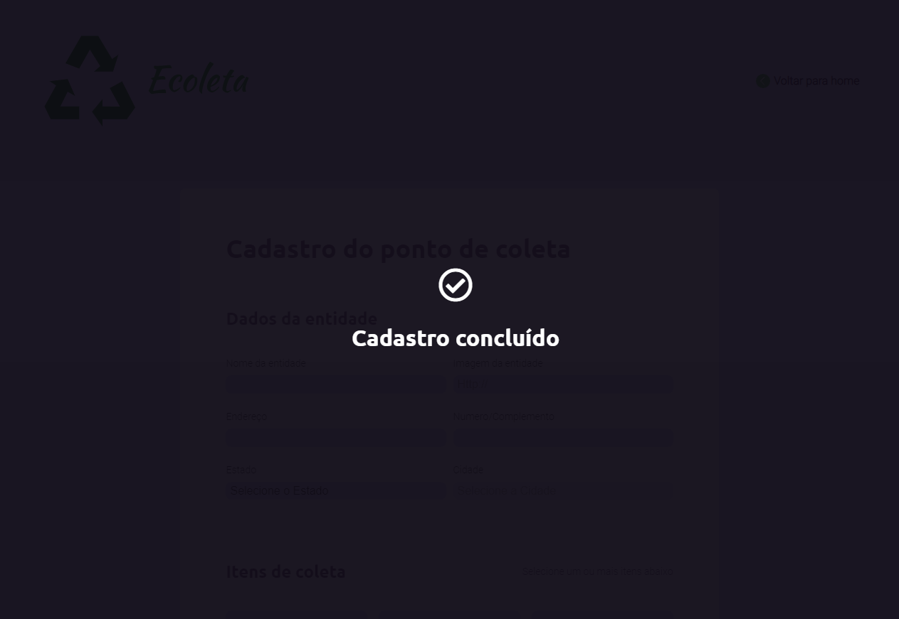
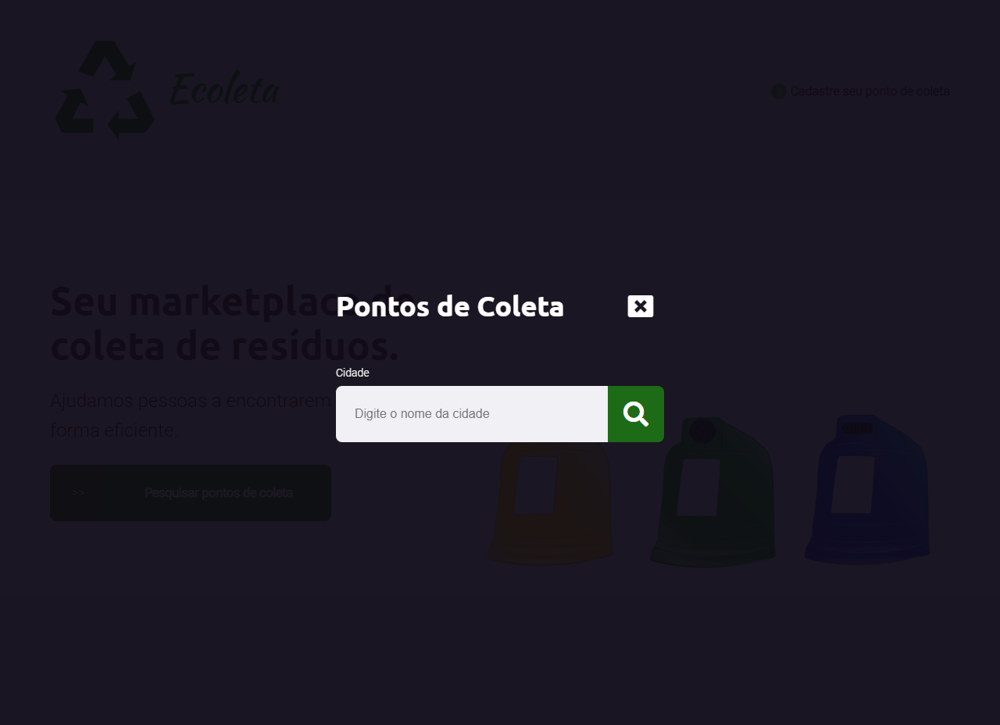
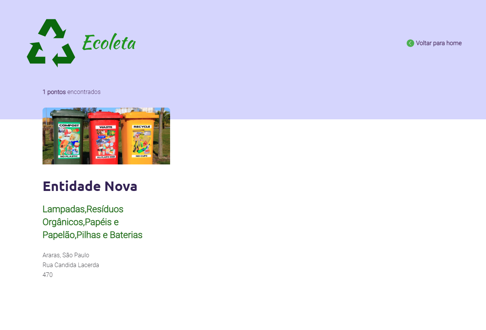

<!-- TITLE -->
<h1>ECOLETA</h1> <br>
<!-- PROJECT LOGO -->
<div align="center">
  <a href="https://github.com/othneildrew/Best-README-Template">
    
  </a><br>
Project developed at the first edition of the "<a href="https://www.rocketseat.com.br/">Rocketseat</a> - Next Level Week"  event. 
<div id="top"></div>
</div><br>  

<!-- 
[![Contributors][contributors-shield]][contributors-url]
[![Forks][forks-shield]][forks-url]
[![Stargazers][stars-shield]][stars-url]
[![Issues][issues-shield]][issues-url] 
-->
[![MIT License][license-shield]](https://github.com/MarioDoncel/NLW1/blob/master/LICENSE)
[![LinkedIn][linkedin-shield]](https://www.linkedin.com/in/marioadoncel/)


<br />


<!-- TABLE OF CONTENTS -->
<details>
  <summary>Table of Contents</summary>
  <ol>
    <li>
      <a href="#about-the-project">About The Project</a>
      <ul>
        <li><a href="#built-with">Built With</a></li>
        <li><a href="#objective">Objective</a></li>
        <li><a href="#status">Status</a></li>
      </ul>
    </li>
    <li>
      <a href="#getting-started">Getting Started</a>
      <ul>
        <li><a href="#prerequisites">Prerequisites</a></li>
        <li><a href="#installation">Installation</a></li>
      </ul>
    </li>
    <li><a href="#usage">Usage</a></li>
    <li><a href="#license">License</a></li>
    <li><a href="#contact">Contact</a></li>
    <li><a href="#acknowledgments">Acknowledgments</a></li>
  </ol>
</details>


<!-- ABOUT THE PROJECT -->
## About The Project

Application developed allows the registration and search of collection points for recyclable material filtered by city.
The search returns all the points registered in the researched city.
Each collection point has the following information:
- Name
- Image
- Full address
- Type of material collected
<p align="right">(<a href="#top">back to top</a>)</p>


### Built With

<!-- This section should list any major frameworks/libraries used to bootstrap your project. Leave any add-ons/plugins for the acknowledgements section. Here are a few examples. -->

* [Node.js](https://nodejs.org/)
* [Express.js (server)](https://expressjs.com/)
* [SQLite (database)](https://www.sqlite.org/)
* [Nunjucks (template engine)](https://mozilla.github.io/nunjucks/)
<!-- 
* [Next.js](https://nextjs.org/)
* [React.js](https://reactjs.org/)
* [Vue.js](https://vuejs.org/)
* [Angular](https://angular.io/)
* [Svelte](https://svelte.dev/)
* [Laravel](https://laravel.com)
* [Bootstrap](https://getbootstrap.com)
* [JQuery](https://jquery.com)
 -->
<p align="right">(<a href="#top">back to top</a>)</p>

### Objective

Project developed just for educacional purposes.
<p align="right">(<a href="#top">back to top</a>)</p>

### Status

Finished.
<p align="right">(<a href="#top">back to top</a>)</p>

<!-- GETTING STARTED -->
## Getting Started

This is an example of how you may give instructions on setting up your project locally.
To get a local copy up and running follow these simple example steps.

### Prerequisites

<!-- This is an example of how to list things you need to use the software and how to install them. -->
* npm
  ```sh
  npm install npm@latest -g
  ```

### Installation

<!-- _Below is an example of how you can instruct your audience on installing and setting up your app. This template doesn't rely on any external dependencies or services._
 -->
<!-- 1. Get a free API Key at [https://example.com](https://example.com) -->
1. Clone the repo
   ```sh
   git clone https://github.com/MarioDoncel/NLW1
   ```
2. Install NPM packages
   ```sh
   npm install
   ```
3. Run the application
   ```js
   npm start 
   ```

<p align="right">(<a href="#top">back to top</a>)</p>


<!-- USAGE EXAMPLES -->
## Usage
<div>
  <p>Index Page - Here you have the option to create a new collect point or search for an existing point.</p>
  
</div>
<br>
<div>
  <p>Create Point Page - Here you need to fill all the inputs and select at least one type of material to collect, then you can create a collect point.</p>
  
</div>
<br>
<div>
  <p>Create Success Modal - After creating a point, if it is everything alright this modal will show up for 3 seconds (timeout).</p>
  
</div>
<br>
<div>
  <p>Search Field Modal - Here you can fill the input with the name of the city where you are looking for collecting points.</p>
  
</div>
<br>
<div>
  <p>Search Results Page - This page will show all the collection points that exists in the city you are searching for.</p>
  
</div>

<p align="right">(<a href="#top">back to top</a>)</p>


<!-- LICENSE -->
## License

Distributed under the MIT License. See `LICENSE.txt` for more information.

<p align="right">(<a href="#top">back to top</a>)</p>


<!-- CONTACT -->
## Contact

Mario Andres Doncel Neto  

Email - 88mario.doncel@gmail.com <br>
Whatsapp - +55 19 99612 9909

Project Link: [https://github.com/MarioDoncel/NLW1](https://github.com/MarioDoncel/NLW1)

<p align="right">(<a href="#top">back to top</a>)</p>


<!-- ACKNOWLEDGMENTS -->
## Acknowledgments

* [Rocketseat](https://www.rocketseat.com.br/)

<p align="right">(<a href="#top">back to top</a>)</p>


<!-- MARKDOWN LINKS & IMAGES -->
<!-- https://www.markdownguide.org/basic-syntax/#reference-style-links -->
[contributors-shield]: https://img.shields.io/github/contributors/othneildrew/Best-README-Template.svg?style=for-the-badge
[contributors-url]: https://github.com/othneildrew/Best-README-Template/graphs/contributors
[forks-shield]: https://img.shields.io/github/forks/othneildrew/Best-README-Template.svg?style=for-the-badge
[forks-url]: https://github.com/othneildrew/Best-README-Template/network/members
[stars-shield]: https://img.shields.io/github/stars/othneildrew/Best-README-Template.svg?style=for-the-badge
[stars-url]: https://github.com/othneildrew/Best-README-Template/stargazers
[issues-shield]: https://img.shields.io/github/issues/othneildrew/Best-README-Template.svg?style=for-the-badge
[issues-url]: https://github.com/othneildrew/Best-README-Template/issues
[license-shield]: https://img.shields.io/github/license/othneildrew/Best-README-Template.svg?style=for-the-badge
[license-url]: https://github.com/othneildrew/Best-README-Template/blob/master/LICENSE.txt
[linkedin-shield]: https://img.shields.io/badge/-LinkedIn-black.svg?style=for-the-badge&logo=linkedin&colorB=555
[linkedin-url]: https://linkedin.com/in/othneildrew
[product-screenshot]: images/screenshot.png
